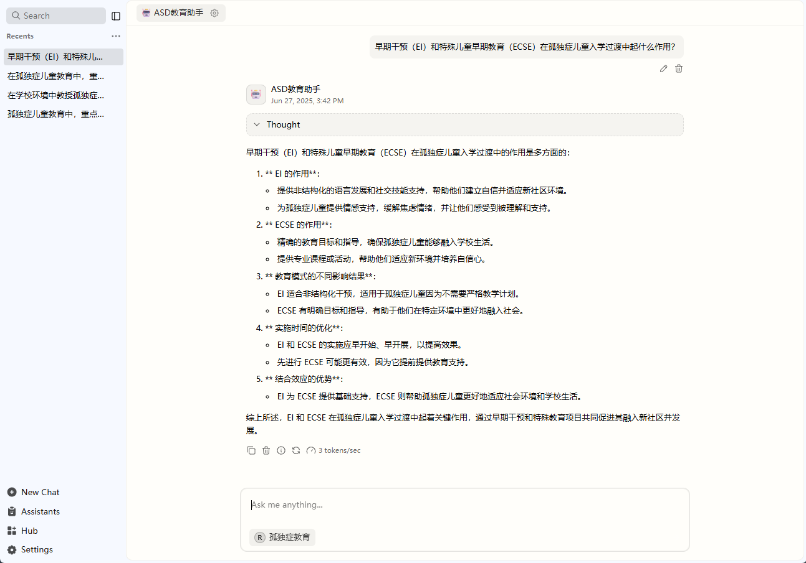
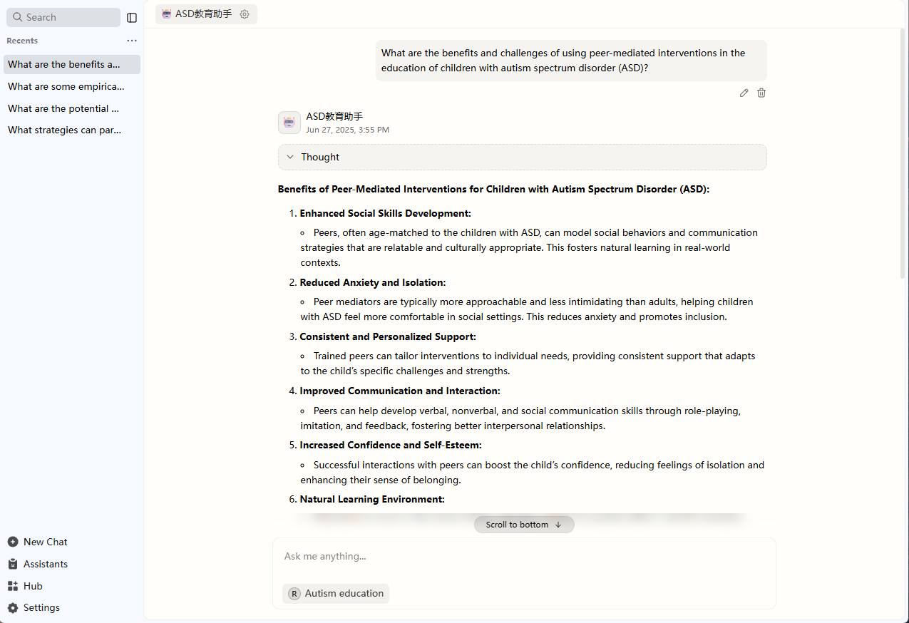

# 🧠 Autism Education Knowledge Graph & QA System

This repository contains the materials for the paper:  
**"Knowledge Graph Construction and Retrieve-Augmented QA for Autism Education"**

## 📚 Overview

This project focuses on **Autism Spectrum Disorder (ASD) education** in children. We construct a domain-specific **knowledge graph (KG)** from extensive educational literature and evaluate its value in enhancing question answering (QA) through a **Retrieve-Augmented Generation (RAG)** framework.

### Key Contributions

- A hierarchical ontology tailored to ASD educational contexts.
- A high-quality knowledge graph built from 203 papers and 4 monographs.
- A benchmark QA dataset covering key dimensions of ASD education.
- Comparative evaluation of small language models with and without KG augmentation.
- A bilingual (English/Chinese) QA demo interface.

## 📘 Methodology

### 1. Knowledge Graph Construction

- Source: 203 peer-reviewed articles and 4 authoritative books.
- Ontology: 12 main classes — `Guideline`, `Effect `, `Intervention`, `Learner`, `Instance`, `Symptom-Type`, `Challenge`, `Educator`, `Institution`, `Outcome-Measure`, `Related-Research`, `Autism-Education`.
- Tools: Used **LightRAG** for entity-first, relation-completion extraction.
- Post-processing:
  - Removed isolated nodes.
  - Filtered low-confidence or ambiguous entities.

**Final Graph:**  
- 3,997 high-quality entities  
- 3,539 semantic triples

### 2. QA Dataset

- No existing public datasets in this field.
- We used **GPT-4o** to generate diverse high-quality QA pairs based on curated literature.
- Questions cover practical and theoretical aspects: diagnosis, support strategies, inclusion, etc.

### 3. Evaluation Strategy

Evaluation is based on the following five weighted dimensions:

| Code | Dimension Name                    | Description                                                                                     | Weight |
|------|-----------------------------------|-------------------------------------------------------------------------------------------------|--------|
| KC   | Knowledge Coverage                | Core concepts and topic relevance (e.g., diagnosis, intervention)                              | 30%    |
| PDA  | Professional Depth & Accuracy     | Use of terminology, scientific accuracy, literature grounding                                   | 35%    |
| PV   | Practical Value                   | Feasibility and relevance of suggestions in educational settings                                | 15%    |
| LS   | Logical Structure                 | Coherence, reasoning structure, alignment with question                                          | 10%    |
| LE   | Language Expression               | Serious expression issues affecting comprehension (minor readability drops allowed)            | 10%    |

---

## 📊 Experimental Results

We tested several small-scale models under consistent evaluation settings:

| Metric                             | DeepSeek-r1 (1.5B) | LLaMA3.2 (1B) | Qwen3 (0.6B) | Qwen3 (1.7B) |
|-----------------------------------|--------------------|---------------|--------------|--------------|
| Score without KG                  | 6.60               | 7.57          | 7.04         | 8.05         |
| Score with KG                     | 6.91               | 7.87          | 7.45         | 8.33         |
| Improved Proportion (%)           | 82.0%              | 81.6%         | **81.9%**    | 79.9%        |
| Average Score Gain                | 0.31               | 0.30          | **0.41**     | 0.28         |
| Avg. Relative Gain per QA (%)     | 4.82%              | **7.51%**     | 6.20%        | 3.64%        |
| Average Gain (↑ only)             | 0.46               | 0.45          | **0.55**     | 0.42         |
| Rel. Gain per QA (↑ only, %)      | 7.18%              | **10.36%**    | 8.19%        | 5.44%        |

> Models performed better across all metrics when using knowledge graph augmentation. Smaller models gained more.

---

## 💻 Demo Interface
Our platform is currently undergoing active internal testing and may be made available in the future. If you are interested in our platform, please feel free to contact us at any time.
### Chinese QA Interface

### English QA Interface

---
## 📬 Contact

Email: cp50321@163.com
